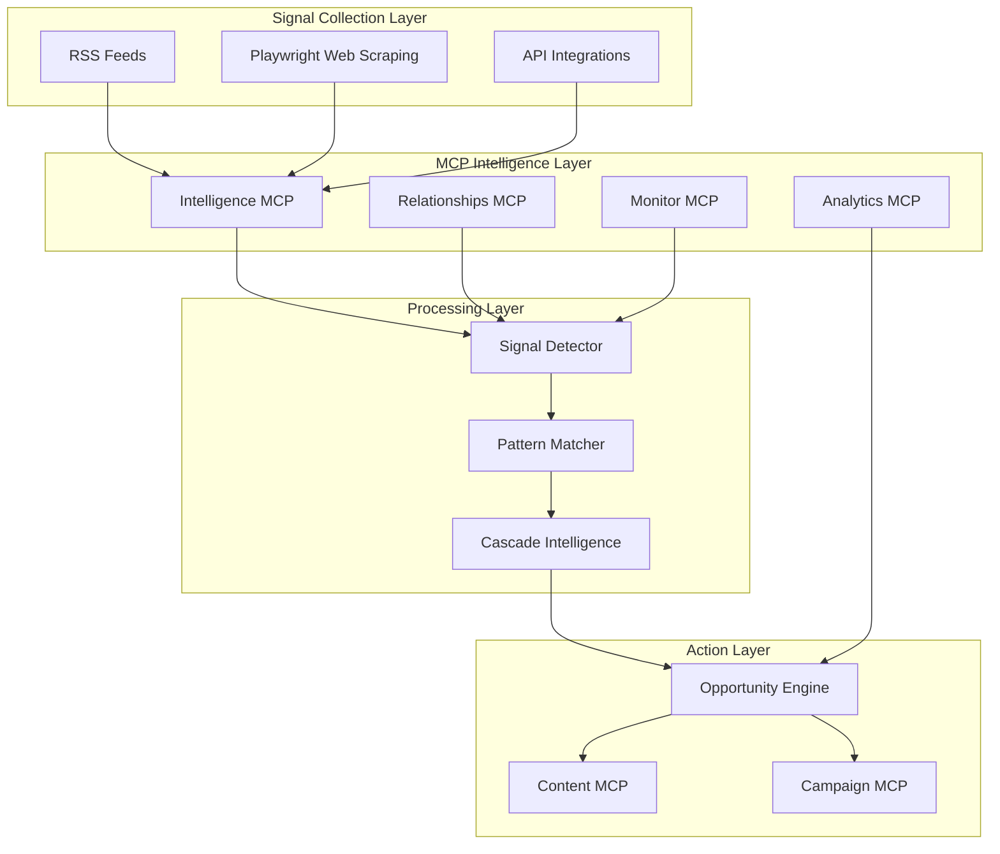

# Opportunity Engine MCP Integration Strategy

## Executive Summary
This document outlines how to integrate Playwright browser automation, existing MCPs, and monitoring capabilities to create a real-time Opportunity Engine that continuously detects and acts on strategic PR opportunities.

## Architecture Overview



## Phase 1: Enhanced Signal Collection

### 1.1 Playwright Web Scraping Integration

Create a Playwright-powered scraping service that goes beyond RSS feeds:

```javascript
// mcp-servers/signaldesk-scraper/src/index.ts
import { chromium } from 'playwright';

class SignalDeskScraper {
  async scrapeCompetitorWebsite(url: string) {
    const browser = await chromium.launch();
    const page = await browser.newPage();
    
    // Intelligent scraping based on site structure
    await page.goto(url);
    
    const signals = {
      // Leadership page changes
      leadership: await this.scrapeLeadershipChanges(page),
      
      // Product updates
      products: await this.scrapeProductUpdates(page),
      
      // Press releases
      press: await this.scrapePressReleases(page),
      
      // Job postings (growth indicators)
      jobs: await this.scrapeJobPostings(page),
      
      // Events & webinars
      events: await this.scrapeEvents(page)
    };
    
    await browser.close();
    return signals;
  }
  
  async monitorSocialMedia(handle: string, platform: string) {
    // Monitor without API access
    const browser = await chromium.launch();
    const page = await browser.newPage();
    
    switch(platform) {
      case 'linkedin':
        return await this.scrapeLinkedIn(page, handle);
      case 'twitter':
        return await this.scrapeTwitter(page, handle);
      // Add more platforms
    }
  }
  
  async detectPageChanges(url: string, previousSnapshot: string) {
    // Visual regression testing for change detection
    const browser = await chromium.launch();
    const page = await browser.newPage();
    await page.goto(url);
    
    const currentSnapshot = await page.screenshot();
    const changes = await this.compareSnapshots(previousSnapshot, currentSnapshot);
    
    if (changes.detected) {
      // Extract what changed
      const changedContent = await this.extractChangedContent(page, changes.regions);
      return { hasChanges: true, content: changedContent };
    }
    
    return { hasChanges: false };
  }
}
```

### 1.2 Connect Playwright to Intelligence MCP

Update the Intelligence MCP to use Playwright for enhanced monitoring:

```typescript
// signaldesk-intelligence/src/index.ts additions
tools: [
  {
    name: 'deep_web_monitor',
    description: 'Monitor competitor websites beyond RSS',
    inputSchema: {
      type: 'object',
      properties: {
        target_urls: { type: 'array', items: { type: 'string' } },
        monitor_type: { 
          type: 'string', 
          enum: ['leadership', 'products', 'press', 'jobs', 'all'] 
        },
        frequency: { type: 'string', enum: ['hourly', 'daily', 'weekly'] }
      }
    }
  },
  {
    name: 'social_sentiment_tracker',
    description: 'Track social media sentiment without APIs',
    inputSchema: {
      type: 'object',
      properties: {
        handles: { type: 'array', items: { type: 'string' } },
        platforms: { type: 'array', items: { type: 'string' } },
        keywords: { type: 'array', items: { type: 'string' } }
      }
    }
  }
]
```

## Phase 2: Signal Detection Pipeline

### 2.1 Real-Time Signal Processor

Create a service that processes all incoming signals:

```javascript
// backend/services/signalProcessor.js
class SignalProcessor {
  constructor() {
    this.mcps = {
      intelligence: new IntelligenceMCP(),
      relationships: new RelationshipsMCP(),
      monitor: new MonitorMCP(),
      analytics: new AnalyticsMCP()
    };
    
    this.detectors = {
      competitor: new CompetitorSignalDetector(),
      narrative: new NarrativeVacuumDetector(),
      cascade: new CascadeDetector(),
      viral: new ViralMomentDetector()
    };
  }
  
  async processSignal(signal) {
    // Enrich signal with MCP data
    const enriched = await this.enrichSignal(signal);
    
    // Detect opportunity patterns
    const opportunities = [];
    
    for (const [type, detector] of Object.entries(this.detectors)) {
      const detected = await detector.analyze(enriched);
      if (detected.isOpportunity) {
        opportunities.push({
          type,
          confidence: detected.confidence,
          window: detected.actionWindow,
          signal: enriched,
          suggestedAction: detected.action
        });
      }
    }
    
    return opportunities;
  }
  
  async enrichSignal(signal) {
    // Add intelligence context
    const intelligence = await this.mcps.intelligence.getMarketContext(signal.keywords);
    
    // Find relevant journalists
    const journalists = await this.mcps.relationships.findJournalists(signal.topic);
    
    // Get performance metrics
    const metrics = await this.mcps.analytics.getRelevantMetrics(signal.type);
    
    return {
      ...signal,
      context: {
        intelligence,
        journalists,
        metrics,
        timestamp: new Date()
      }
    };
  }
}
```

### 2.2 Pattern Recognition System

Implement the opportunity patterns from your strategy:

```javascript
// backend/services/opportunityPatterns.js
class OpportunityPatternMatcher {
  patterns = {
    competitorStumble: {
      requiredSignals: ['negative_sentiment', 'leadership_change', 'product_issue'],
      confidence: (signals) => {
        const score = signals.filter(s => s.present).length / 3;
        return score > 0.6 ? score : 0;
      },
      actionWindow: '24-48 hours',
      suggestedResponse: 'Position as stable alternative'
    },
    
    narrativeVacuum: {
      requiredSignals: ['high_search_volume', 'low_expert_coverage', 'journalist_interest'],
      confidence: (signals) => {
        // Complex scoring based on signal strength
        return this.calculateNarrativeOpportunity(signals);
      },
      actionWindow: '3-5 days',
      suggestedResponse: 'Offer executive as expert source'
    },
    
    cascadeEvent: {
      requiredSignals: ['primary_disruption', 'industry_impact', 'supply_chain_effect'],
      confidence: (signals) => {
        return this.predictCascadeProbability(signals);
      },
      actionWindow: '1-3 days for first mover',
      suggestedResponse: 'Pre-position for cascade effects'
    }
  };
  
  async matchPatterns(enrichedSignal) {
    const matches = [];
    
    for (const [patternName, pattern] of Object.entries(this.patterns)) {
      const signals = await this.extractPatternSignals(enrichedSignal, pattern.requiredSignals);
      const confidence = pattern.confidence(signals);
      
      if (confidence > 0.5) {
        matches.push({
          pattern: patternName,
          confidence,
          window: pattern.actionWindow,
          action: pattern.suggestedResponse
        });
      }
    }
    
    return matches;
  }
}
```

## Phase 3: Cascade Intelligence Implementation

### 3.1 Cascade Prediction Engine

Your unique differentiator - predicting cascade effects:

```javascript
// backend/services/cascadeIntelligence.js
class CascadeIntelligence {
  constructor() {
    this.historicalCascades = new CascadeDatabase();
    this.industryGraph = new IndustryRelationshipGraph();
  }
  
  async predictCascade(primaryEvent) {
    // Map the cascade potential
    const cascade = {
      primary: primaryEvent,
      firstOrder: [], // Direct impacts
      secondOrder: [], // Indirect impacts
      thirdOrder: [], // System-wide effects
      opportunities: []
    };
    
    // Analyze first-order effects
    cascade.firstOrder = await this.analyzeDirectImpacts(primaryEvent);
    
    // Predict second-order effects
    for (const impact of cascade.firstOrder) {
      const secondary = await this.analyzeSecondaryImpacts(impact);
      cascade.secondOrder.push(...secondary);
    }
    
    // Identify opportunities in the cascade
    cascade.opportunities = this.identifyOpportunityWindows(cascade);
    
    return cascade;
  }
  
  identifyOpportunityWindows(cascade) {
    const opportunities = [];
    
    // Immediate opportunities (1-3 days)
    if (cascade.firstOrder.some(i => i.type === 'competitor_weakness')) {
      opportunities.push({
        timing: 'immediate',
        action: 'Position as stable alternative',
        confidence: 0.85
      });
    }
    
    // Near-term opportunities (1-2 weeks)
    if (cascade.secondOrder.some(i => i.type === 'market_disruption')) {
      opportunities.push({
        timing: 'near-term',
        action: 'Thought leadership on industry resilience',
        confidence: 0.70
      });
    }
    
    // Long-term positioning (1-3 months)
    if (cascade.thirdOrder.some(i => i.type === 'regulatory_response')) {
      opportunities.push({
        timing: 'long-term',
        action: 'Shape regulatory narrative',
        confidence: 0.60
      });
    }
    
    return opportunities;
  }
}
```

### 3.2 Historical Learning System

Learn from past cascades to improve predictions:

```javascript
// backend/services/cascadeLearning.js
class CascadeLearningSystem {
  async learn(cascade, actualOutcome) {
    // Store the cascade and outcome
    await this.db.saveCascadeOutcome({
      predicted: cascade,
      actual: actualOutcome,
      accuracy: this.calculateAccuracy(cascade, actualOutcome)
    });
    
    // Update prediction models
    await this.updatePredictionWeights(cascade, actualOutcome);
    
    // Identify new patterns
    const newPatterns = await this.identifyNewPatterns(actualOutcome);
    if (newPatterns.length > 0) {
      await this.addNewPatterns(newPatterns);
    }
  }
  
  async improveFromHistory() {
    const historicalCascades = await this.db.getHistoricalCascades();
    
    // Analyze what we got right and wrong
    const analysis = {
      accuratePredictions: [],
      missedOpportunities: [],
      falsePositives: []
    };
    
    for (const cascade of historicalCascades) {
      if (cascade.accuracy > 0.7) {
        analysis.accuratePredictions.push(cascade);
      } else if (cascade.actual.hadOpportunity && !cascade.predicted.opportunities) {
        analysis.missedOpportunities.push(cascade);
      } else if (!cascade.actual.hadOpportunity && cascade.predicted.opportunities) {
        analysis.falsePositives.push(cascade);
      }
    }
    
    // Update models based on analysis
    await this.refineModels(analysis);
  }
}
```

## Phase 4: MCP Orchestration

### 4.1 Unified MCP Controller

Coordinate all MCPs for opportunity detection:

```javascript
// backend/services/mcpOrchestrator.js
class MCPOrchestrator {
  constructor() {
    this.mcps = {
      intelligence: new IntelligenceMCP(),
      relationships: new RelationshipsMCP(),
      analytics: new AnalyticsMCP(),
      content: new ContentMCP(),
      campaigns: new CampaignsMCP(),
      monitor: new MonitorMCP(),
      memory: new MemoryMCP(),
      playwright: new PlaywrightMCP()
    };
  }
  
  async runOpportunityDiscovery(organization) {
    // Deploy MCPs in parallel for maximum efficiency
    const [
      marketIntel,
      competitorMoves,
      journalistActivity,
      performanceData,
      webChanges
    ] = await Promise.all([
      this.mcps.intelligence.scanMarket(organization),
      this.mcps.monitor.checkCompetitors(organization),
      this.mcps.relationships.getJournalistBeat(organization),
      this.mcps.analytics.getMetrics(organization),
      this.mcps.playwright.monitorWebChanges(organization)
    ]);
    
    // Process signals through pattern matching
    const signals = this.combineSignals({
      marketIntel,
      competitorMoves,
      journalistActivity,
      performanceData,
      webChanges
    });
    
    // Check for cascade potential
    const cascades = await this.detectCascades(signals);
    
    // Generate opportunities
    const opportunities = await this.generateOpportunities(signals, cascades);
    
    // Prepare content for high-priority opportunities
    for (const opp of opportunities.filter(o => o.priority === 'high')) {
      opp.preparedContent = await this.mcps.content.generateContent(opp);
      opp.campaign = await this.mcps.campaigns.planCampaign(opp);
    }
    
    // Store in memory for learning
    await this.mcps.memory.storeOpportunities(opportunities);
    
    return opportunities;
  }
}
```

### 4.2 Real-Time Monitoring Loop

Continuous monitoring implementation:

```javascript
// backend/services/continuousMonitor.js
class ContinuousMonitor {
  constructor() {
    this.orchestrator = new MCPOrchestrator();
    this.intervals = new Map();
  }
  
  async startMonitoring(organization) {
    // High-priority: Check every 15 minutes
    this.intervals.set(`${organization.id}-high`, setInterval(async () => {
      const opportunities = await this.orchestrator.runOpportunityDiscovery(organization);
      const urgent = opportunities.filter(o => o.window < '6 hours');
      
      if (urgent.length > 0) {
        await this.alertUrgentOpportunities(urgent, organization);
      }
    }, 15 * 60 * 1000));
    
    // Medium-priority: Check every hour
    this.intervals.set(`${organization.id}-medium`, setInterval(async () => {
      const opportunities = await this.orchestrator.runOpportunityDiscovery(organization);
      const medium = opportunities.filter(o => 
        o.window >= '6 hours' && o.window < '48 hours'
      );
      
      if (medium.length > 0) {
        await this.queueOpportunities(medium, organization);
      }
    }, 60 * 60 * 1000));
    
    // Cascade detection: Check every 30 minutes
    this.intervals.set(`${organization.id}-cascade`, setInterval(async () => {
      const cascades = await this.detectEmergingCascades(organization);
      
      if (cascades.length > 0) {
        await this.alertCascadeOpportunities(cascades, organization);
      }
    }, 30 * 60 * 1000));
  }
  
  async detectEmergingCascades(organization) {
    // Use Playwright to monitor specific indicators
    const indicators = await this.orchestrator.mcps.playwright.monitorCascadeIndicators([
      'supply chain disruption news',
      'regulatory announcements',
      'major tech outages',
      'executive scandals',
      'data breaches'
    ]);
    
    // Analyze for cascade potential
    const cascades = [];
    for (const indicator of indicators) {
      const cascade = await this.cascadeIntelligence.predictCascade(indicator);
      if (cascade.confidence > 0.6) {
        cascades.push(cascade);
      }
    }
    
    return cascades;
  }
}
```

## Phase 5: Opportunity Action System

### 5.1 Automated Opportunity Briefs

Generate actionable briefs automatically:

```javascript
// backend/services/opportunityBriefGenerator.js
class OpportunityBriefGenerator {
  async generateBrief(opportunity, organization) {
    const brief = {
      // Executive Summary
      headline: await this.generateHeadline(opportunity),
      urgency: opportunity.window,
      confidence: opportunity.confidence,
      
      // Situation Analysis
      situation: {
        what: opportunity.signal.description,
        why: opportunity.pattern.explanation,
        impact: await this.assessImpact(opportunity, organization)
      },
      
      // Strategic Approach
      strategy: {
        positioning: await this.determinePositioning(opportunity, organization),
        keyMessages: await this.mcps.content.generateKeyMessages(opportunity),
        differentiators: await this.identifyDifferentiators(opportunity, organization)
      },
      
      // Pre-generated Assets
      assets: {
        pressRelease: await this.mcps.content.generatePressRelease(opportunity),
        pitchEmail: await this.mcps.content.generatePitch(opportunity),
        socialPosts: await this.mcps.content.generateSocialContent(opportunity),
        talkingPoints: await this.mcps.content.generateTalkingPoints(opportunity)
      },
      
      // Media Strategy
      media: {
        journalists: await this.mcps.relationships.getBestJournalists(opportunity),
        outlets: await this.mcps.relationships.getTargetOutlets(opportunity),
        timing: this.calculateOptimalTiming(opportunity)
      },
      
      // Execution Plan
      execution: {
        timeline: this.createTimeline(opportunity),
        tasks: await this.mcps.campaigns.generateTasks(opportunity),
        resources: this.identifyResources(opportunity),
        approvals: this.getRequiredApprovals(opportunity)
      },
      
      // Success Metrics
      metrics: {
        kpis: this.defineKPIs(opportunity),
        tracking: await this.mcps.analytics.setupTracking(opportunity),
        reporting: this.scheduleReporting(opportunity)
      }
    };
    
    return brief;
  }
}
```

### 5.2 Smart Alert System

Intelligent alerting based on opportunity quality:

```javascript
// backend/services/intelligentAlerting.js
class IntelligentAlertSystem {
  async evaluateAlert(opportunity, organization) {
    // Get organization readiness
    const readiness = await this.assessReadiness(organization, opportunity);
    
    // Calculate opportunity score
    const score = this.calculateOpportunityScore(opportunity, readiness);
    
    // Determine alert level
    if (score > 90 && opportunity.window < '6 hours') {
      return {
        level: 'URGENT',
        channels: ['email', 'sms', 'slack'],
        message: 'High-value opportunity requiring immediate action'
      };
    } else if (score > 75 && opportunity.window < '24 hours') {
      return {
        level: 'HIGH',
        channels: ['email', 'slack'],
        message: 'Strategic opportunity within action window'
      };
    } else if (score > 60) {
      return {
        level: 'MEDIUM',
        channels: ['email'],
        message: 'Opportunity for consideration'
      };
    } else {
      return {
        level: 'LOW',
        channels: ['dashboard'],
        message: 'Logged for review'
      };
    }
  }
  
  calculateOpportunityScore(opportunity, readiness) {
    const factors = {
      patternConfidence: opportunity.confidence * 30,
      cascadePotential: (opportunity.cascade?.potential || 0) * 20,
      competitiveAdvantage: this.assessAdvantage(opportunity) * 20,
      organizationReadiness: readiness * 15,
      mediaInterest: opportunity.mediaRelevance * 15
    };
    
    return Object.values(factors).reduce((sum, val) => sum + val, 0);
  }
}
```

## Implementation Roadmap

### Week 1-2: Foundation
1. Install and configure Playwright MCP
2. Create web scraping service
3. Connect to existing Intelligence MCP
4. Test basic signal collection

### Week 3-4: Signal Processing
1. Build signal detection pipeline
2. Implement pattern matching
3. Create cascade detection system
4. Test with historical data

### Week 5-6: MCP Integration
1. Create MCP orchestrator
2. Implement continuous monitoring
3. Connect all MCPs for enrichment
4. Test real-time detection

### Week 7-8: Action System
1. Build brief generation system
2. Implement smart alerting
3. Create feedback loop
4. Deploy to production

## Database Schema Updates

```sql
-- New tables needed
CREATE TABLE opportunity_patterns (
  id UUID PRIMARY KEY,
  name VARCHAR(255),
  required_signals JSONB,
  confidence_threshold DECIMAL(3,2),
  action_window VARCHAR(50),
  suggested_response TEXT
);

CREATE TABLE cascade_predictions (
  id UUID PRIMARY KEY,
  primary_event JSONB,
  first_order_effects JSONB,
  second_order_effects JSONB,
  third_order_effects JSONB,
  opportunities JSONB,
  confidence DECIMAL(3,2),
  created_at TIMESTAMP DEFAULT NOW()
);

CREATE TABLE detected_opportunities (
  id UUID PRIMARY KEY,
  organization_id UUID REFERENCES organizations(id),
  pattern_id UUID REFERENCES opportunity_patterns(id),
  signal_data JSONB,
  cascade_id UUID REFERENCES cascade_predictions(id),
  confidence DECIMAL(3,2),
  action_window VARCHAR(50),
  status VARCHAR(50),
  brief JSONB,
  created_at TIMESTAMP DEFAULT NOW()
);

CREATE TABLE opportunity_outcomes (
  id UUID PRIMARY KEY,
  opportunity_id UUID REFERENCES detected_opportunities(id),
  action_taken BOOLEAN,
  outcome JSONB,
  success_metrics JSONB,
  lessons_learned TEXT,
  created_at TIMESTAMP DEFAULT NOW()
);
```

## Success Metrics

1. **Detection Rate**: Number of valid opportunities detected per day
2. **Action Rate**: Percentage of opportunities acted upon
3. **Success Rate**: Percentage of acted opportunities that achieved goals
4. **Time to Detection**: Average time from signal to opportunity identification
5. **Cascade Accuracy**: Percentage of correctly predicted cascade effects

## Unique Value Propositions

1. **Cascade Intelligence**: No other platform predicts downstream effects
2. **MCP-Powered Enrichment**: Deep context from multiple specialized agents
3. **Playwright Web Monitoring**: Beyond RSS to deep web intelligence
4. **Pattern Learning**: System improves with every opportunity
5. **Pre-Generated Assets**: Ready-to-use content when opportunity strikes

This integration creates a truly intelligent PR platform that doesn't just analyze - it actively hunts for opportunities and prepares you to capitalize on them instantly.