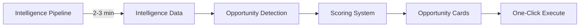
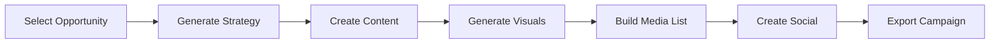

# SignalDesk V3: Complete Technical Specification
## The Single Source of Truth - Everything You Need to Know

### Document Version: 1.0
### Last Updated: August 2025
### Status: Implementation Ready

---

# TABLE OF CONTENTS

1. [PROJECT OVERVIEW](#project-overview)
2. [SYSTEM ARCHITECTURE](#system-architecture)
3. [EXISTING COMPONENTS INVENTORY](#existing-components-inventory)
4. [API SPECIFICATIONS](#api-specifications)
5. [DATABASE SCHEMA](#database-schema)
6. [FRONTEND ARCHITECTURE](#frontend-architecture)
7. [BACKEND SERVICES](#backend-services)
8. [INTEGRATION MAP](#integration-map)
9. [DEPLOYMENT CONFIGURATION](#deployment-configuration)
10. [IMPLEMENTATION WORKPLAN](#implementation-workplan)
11. [SECURITY & COMPLIANCE](#security-compliance)
12. [PERFORMANCE REQUIREMENTS](#performance-requirements)

---

# 1. PROJECT OVERVIEW

## Core Vision
**One-Click Autonomous PR Execution**: From opportunity detection to complete campaign deployment in under 60 seconds.

## Platform Capabilities
1. **Intelligence Pipeline**: 7-stage analysis in 2-3 minutes
2. **Opportunity Detection**: Real-time, no fallbacks
3. **Campaign Execution**: Complete content + media + visuals
4. **Memory & Learning**: Pattern recognition and optimization
5. **Crisis Management**: War room coordination

## Key Differentiators
- **Infinite Canvas UI**: Multiple components open simultaneously
- **Export-Only System**: No direct posting (liability protection)
- **Context-Aware AI**: Niv sees what you see
- **Wow Onboarding**: 3-4 minutes to first opportunity

---

# 2. SYSTEM ARCHITECTURE

## High-Level Architecture
```
┌─────────────────────────────────────────────────────────┐
│                   FRONTEND (Next.js 14)                  │
│                    Infinite Canvas UI                    │
│                    5 Main Tab System                     │
├─────────────────────────────────────────────────────────┤
│                   API LAYER (Next.js API)                │
├─────────────────────────────────────────────────────────┤
│              EDGE FUNCTIONS (Supabase/Deno)              │
│          30 Production Functions (from 100+)             │
├─────────────────────────────────────────────────────────┤
│                 MCP SERVERS (17 Total)                   │
│            Specialized Intelligence Modules              │
├─────────────────────────────────────────────────────────┤
│              DATABASE (Supabase Postgres)                │
│                     With RLS & Vector                    │
└─────────────────────────────────────────────────────────┘
```

## Technology Stack
```yaml
Frontend:
  Framework: Next.js 14 with App Directory
  Language: TypeScript
  Styling: Tailwind CSS
  State: Zustand
  Data Fetching: @tanstack/react-query
  UI Components: 
    - framer-motion (animations)
    - lucide-react (icons)
    - react-draggable (canvas)
    - react-window (virtualization)

Backend:
  Edge Functions: Supabase Functions (Deno runtime)
  Database: Supabase Postgres
  Vector DB: pgvector extension
  Storage: Supabase Storage
  Auth: Supabase Auth

AI Services:
  Primary: Claude 3 (Anthropic)
  Images: Google Imagen 3 (Vertex AI)
  Video: Synthesia (if available)
  Embeddings: Google text-embedding-004 or OpenAI text-embedding-3

External APIs:
  News: NewsAPI
  Search: Google Custom Search
  Scraping: Firecrawl
  Social: Platform APIs
```

---

# 3. EXISTING COMPONENTS INVENTORY

## Edge Functions (Currently 100+, Target: 30)

### Production Functions to Keep
```typescript
// Intelligence Pipeline (7 stages)
'intelligence-discovery-v3'          // Organization extraction
'intelligence-stage-1-competitors'   // Competitive analysis
'intelligence-stage-2-media'         // Media + Stakeholders
'intelligence-stage-3-regulatory'    // Regulatory environment
'intelligence-stage-4-trends'        // Market trends
'intelligence-stage-5-synthesis'     // Final consolidation
'intelligence-persistence'           // Data storage

// Opportunity System
'opportunity-orchestrator'           // Real detection, no fallbacks
'opportunity-detector-v3'            // Pattern detection
'opportunity-enhancer'               // Claude enhancement
'opportunity-executor'               // Campaign generation
'assess-opportunities-simple'        // Scoring

// Niv System (KEEP ONLY ONE)
'niv-orchestrator-robust'           // PRODUCTION VERSION

// Content & Media
'content-intelligence'               // Content generation
'media-intelligence'                 // Media lists
'campaigns-intelligence'             // Campaign orchestration

// Supporting Functions
'organization-discovery'             // Entity extraction
'intelligence-orchestrator'         // Pipeline coordination
'intelligence-memory'                // Memory operations
'crisis-intelligence'                // Crisis detection
'social-intelligence'                // Social monitoring
```

### Functions to Archive
```bash
# Archive these duplicates:
niv-* (except niv-orchestrator-robust) # 16 versions
intelligence-*-v[1-2]                   # Old versions
claude-intelligence-synthesizer-v[1-6]  # Old synthesizers
```

## MCP Servers (17 Total)

### Complete & Functional (15)
```yaml
signaldesk-crisis:         7 tools - Crisis management
signaldesk-social:         7 tools - Social monitoring
signaldesk-stakeholder-groups: 7 tools - Coalition detection
signaldesk-narratives:     7 tools - Narrative tracking
signaldesk-opportunities:  6 tools - Opportunity management
signaldesk-content:        5 tools - Content generation
signaldesk-media:          5 tools - Media intelligence
signaldesk-campaigns:      4 tools - Campaign orchestration
signaldesk-memory:         5 tools - Learning system
signaldesk-analytics:      Analytics tracking
signaldesk-entities:       Entity extraction
signaldesk-relationships:  Relationship mapping
signaldesk-scraper:        Web scraping
signaldesk-intelligence:   PR analysis
signaldesk-monitor:        Monitoring
```

### In Progress (2)
```yaml
signaldesk-regulatory:     Needs 7 tools implementation
signaldesk-orchestrator:   Needs coordination logic
```

## Frontend Components (Existing)
```
src/components/
├── RailwayV2.js              # Current main UI
├── RailwayDraggable.js       # Draggable components
├── MultiStageIntelligence.js # Pipeline UI (HAS BUG)
├── OpportunityEngine.js      # Opportunity detection
├── CrisisCommandCenter.js    # Crisis management
├── MemoryVaultModule.js      # Learning system
├── NivStrategicAdvisor.js    # AI assistant
└── Onboarding/
    ├── SimplifiedOnboarding.js
    └── OnboardingWithMCPs.js
```

---

# 4. API SPECIFICATIONS

## Environment Variables Required

### Supabase Configuration
```env
# Frontend (public)
NEXT_PUBLIC_SUPABASE_URL=https://zskaxjtyuaqazydouifp.supabase.co
NEXT_PUBLIC_SUPABASE_ANON_KEY=eyJhbGciOiJIUzI1NiIsInR5cCI6IkpXVCJ9...

# Backend (secret)
SUPABASE_SERVICE_ROLE_KEY=[SECRET]
SUPABASE_JWT_SECRET=[SECRET]
```

### AI Service Keys
```env
# Claude (Anthropic)
ANTHROPIC_API_KEY=sk-ant-api03-[SECRET]

# Google Cloud (for Imagen 3)
GOOGLE_CLOUD_API_KEY=[SECRET - NEVER COMMIT]
GOOGLE_CLOUD_PROJECT_ID=[YOUR-PROJECT-ID]

# Synthesia (optional)
SYNTHESIA_API_KEY=[SECRET]
```

### External Service Keys
```env
# News & Search
NEWS_API_KEY=[SECRET]
GOOGLE_API_KEY=[SECRET]
GOOGLE_CSE_ID=[SECRET]

# Web Scraping
FIRECRAWL_API_KEY=fc-[SECRET]

# Social Media (optional)
TWITTER_API_KEY=[SECRET]
LINKEDIN_API_KEY=[SECRET]
```

## API Endpoints

### Intelligence Pipeline
```typescript
POST /api/intelligence/run
{
  organization: string,
  domain: string,
  goals?: string[]
}
Response: {
  pipelineId: string,
  status: 'running' | 'complete',
  stages: StageResult[],
  duration: number // 2-3 minutes
}

GET /api/intelligence/status/:pipelineId
Response: {
  status: string,
  progress: number, // 0-100
  currentStage: string,
  results?: IntelligenceData
}
```

### Opportunity Detection
```typescript
POST /api/opportunities/detect
{
  intelligenceData: IntelligenceData,
  goals: string[]
}
Response: {
  opportunities: Opportunity[],
  scored: boolean,
  recommendations: string[]
}

POST /api/opportunities/execute/:id
Response: {
  campaign: {
    strategy: Strategy,
    content: Content[],
    visuals: Visual[],
    media: MediaList,
    social: SocialPosts[]
  },
  exportUrl: string // PDF/Word download
}
```

### Content Generation
```typescript
POST /api/content/generate
{
  type: 'press_release' | 'blog' | 'email' | 'social' | 'bio',
  context: any,
  tone?: string,
  length?: number
}
Response: {
  content: string,
  variations?: string[],
  metadata: ContentMetadata
}
```

### Visual Generation (NEW - Google Imagen)
```typescript
POST /api/visuals/generate-image
{
  prompt: string,
  negativePrompt?: string,
  aspectRatio?: '1:1' | '16:9' | '9:16' | '4:3' | '3:4',
  guidanceScale?: number, // 0-20, default 7.5
  numberOfImages?: number // 1-8
}
Response: {
  url: string,
  storageId: string,
  model: 'imagen-3'
}

POST /api/visuals/generate-video
{
  script: string,
  avatar?: string,
  duration?: number
}
Response: {
  url: string,
  processingTime: number
}
```

### Export System (NEW - CRITICAL)
```typescript
POST /api/export/campaign
{
  campaignId: string,
  format: 'pdf' | 'word' | 'csv' | 'social-drafts',
  includeWatermark: true // ALWAYS TRUE
}
Response: {
  downloadUrl: string,
  auditLog: {
    exportedAt: Date,
    exportedBy: string,
    format: string,
    watermarked: true
  }
}
```

---

# 5. DATABASE SCHEMA

## Core Tables
```sql
-- Organizations
CREATE TABLE organizations (
  id UUID PRIMARY KEY DEFAULT gen_random_uuid(),
  name TEXT NOT NULL,
  domain TEXT,
  industry TEXT,
  size TEXT,
  config JSONB DEFAULT '{}',
  created_at TIMESTAMPTZ DEFAULT NOW()
);

-- Users & Auth
CREATE TABLE profiles (
  id UUID PRIMARY KEY DEFAULT gen_random_uuid(),
  user_id UUID REFERENCES auth.users(id),
  organization_id UUID REFERENCES organizations(id),
  role TEXT DEFAULT 'member',
  preferences JSONB DEFAULT '{}',
  created_at TIMESTAMPTZ DEFAULT NOW()
);

-- Intelligence Pipeline
CREATE TABLE intelligence_runs (
  id UUID PRIMARY KEY DEFAULT gen_random_uuid(),
  organization_id UUID REFERENCES organizations(id),
  status TEXT DEFAULT 'pending',
  stages_complete INTEGER DEFAULT 0,
  results JSONB,
  duration_ms INTEGER,
  created_at TIMESTAMPTZ DEFAULT NOW(),
  completed_at TIMESTAMPTZ
);

-- Opportunities
CREATE TABLE opportunities (
  id UUID PRIMARY KEY DEFAULT gen_random_uuid(),
  organization_id UUID REFERENCES organizations(id),
  title TEXT NOT NULL,
  description TEXT,
  score INTEGER CHECK (score >= 0 AND score <= 100),
  urgency TEXT CHECK (urgency IN ('high', 'medium', 'low')),
  time_window TEXT,
  source TEXT,
  data JSONB,
  created_at TIMESTAMPTZ DEFAULT NOW(),
  expires_at TIMESTAMPTZ
);

-- Campaigns
CREATE TABLE campaigns (
  id UUID PRIMARY KEY DEFAULT gen_random_uuid(),
  organization_id UUID REFERENCES organizations(id),
  opportunity_id UUID REFERENCES opportunities(id),
  status TEXT DEFAULT 'draft',
  content JSONB,
  visuals JSONB,
  media_list JSONB,
  social_posts JSONB,
  exports JSONB[], -- Track all exports for liability
  created_at TIMESTAMPTZ DEFAULT NOW(),
  executed_at TIMESTAMPTZ
);

-- MemoryVault with Vector Support
CREATE TABLE memoryvault (
  id UUID PRIMARY KEY DEFAULT gen_random_uuid(),
  organization_id UUID REFERENCES organizations(id),
  type TEXT,
  content JSONB,
  embedding vector(1536), -- For semantic search
  patterns JSONB,
  success_metrics JSONB,
  created_at TIMESTAMPTZ DEFAULT NOW()
);

-- MemoryVault Attachments (NEW)
CREATE TABLE memoryvault_attachments (
  id UUID PRIMARY KEY DEFAULT gen_random_uuid(),
  organization_id UUID REFERENCES organizations(id),
  file_name TEXT NOT NULL,
  file_url TEXT,
  file_type TEXT,
  extracted_text TEXT,
  key_points JSONB,
  embedding vector(1536),
  created_at TIMESTAMPTZ DEFAULT NOW()
);

-- Monitoring Alerts (NEW)
CREATE TABLE monitoring_alerts (
  id UUID PRIMARY KEY DEFAULT gen_random_uuid(),
  organization_id UUID REFERENCES organizations(id),
  type TEXT CHECK (type IN ('opportunity', 'crisis', 'deadline')),
  title TEXT,
  message TEXT,
  data JSONB,
  status TEXT DEFAULT 'unread',
  created_at TIMESTAMPTZ DEFAULT NOW()
);

-- Canvas State (NEW)
CREATE TABLE canvas_states (
  id UUID PRIMARY KEY DEFAULT gen_random_uuid(),
  user_id UUID REFERENCES auth.users(id),
  components JSONB, -- Component positions and states
  scale NUMERIC DEFAULT 1,
  scroll_position JSONB,
  created_at TIMESTAMPTZ DEFAULT NOW(),
  updated_at TIMESTAMPTZ DEFAULT NOW()
);
```

## Row Level Security (RLS)
```sql
-- Enable RLS on all tables
ALTER TABLE organizations ENABLE ROW LEVEL SECURITY;
ALTER TABLE profiles ENABLE ROW LEVEL SECURITY;
ALTER TABLE intelligence_runs ENABLE ROW LEVEL SECURITY;
-- ... (enable for all tables)

-- Example RLS Policy
CREATE POLICY "Users can view own organization data" ON organizations
  FOR SELECT USING (
    id IN (
      SELECT organization_id FROM profiles 
      WHERE user_id = auth.uid()
    )
  );
```

---

# 6. FRONTEND ARCHITECTURE

## Infinite Canvas UI System

### Component Structure
```typescript
interface InfiniteCanvasUI {
  // Fixed header with tabs
  header: {
    tabs: [
      'Intelligence',   // 🧠 Pipeline & analysis
      'Opportunities',  // 🎯 Scored opportunities
      'Plan',          // 📋 Strategic planning
      'Execute',       // 🚀 Content & campaigns
      'MemoryVault'    // 💾 Patterns & learning
    ],
    user: UserMenu,
    search: UniversalSearch
  },
  
  // Infinite scrollable canvas
  canvas: {
    type: 'infinite-scroll',
    components: CanvasComponent[],
    interaction: {
      drag: true,
      resize: true,
      minimize: true,
      maximize: true
    },
    grid: {
      enabled: boolean,
      size: 20 // pixels
    },
    persistence: 'localStorage + Supabase'
  },
  
  // Floating elements
  floating: {
    niv: NivOverlay,
    notifications: AlertBadges,
    quickActions: FAB[]
  }
}
```

### Canvas Component Model
```typescript
interface CanvasComponent {
  id: string;
  type: 'intelligence' | 'opportunities' | 'plan' | 'execute' | 'memoryvault';
  position: { x: number; y: number };
  size: { width: number; height: number };
  zIndex: number;
  state: 'normal' | 'focused' | 'minimized' | 'maximized';
  opacity: number;
  locked: boolean;
  data: any; // Component-specific data
}
```

### Tab Behavior
```typescript
const TAB_BEHAVIOR = {
  onClick: (tab: TabType) => {
    // 1. Check if component exists on canvas
    const existing = findComponentByType(tab);
    
    if (existing) {
      // 2. Scroll to and focus
      scrollToComponent(existing);
      focusComponent(existing);
    } else {
      // 3. Create new at center
      const component = createComponent(tab);
      addToCanvas(component);
      focusComponent(component);
    }
    
    // 4. Dim other components
    dimOthers(component.id, 0.6);
  },
  
  onDoubleClick: (tab: TabType) => {
    maximizeComponent(tab);
  }
};
```

## State Management (Zustand)
```typescript
interface AppState {
  // Authentication
  user: User | null;
  organization: Organization | null;
  
  // Canvas
  canvasComponents: Map<string, CanvasComponent>;
  canvasScale: number;
  activeTab: TabType;
  
  // Intelligence
  intelligenceData: IntelligenceData | null;
  pipelineStatus: 'idle' | 'running' | 'complete' | 'error';
  pipelineProgress: number; // 0-100
  
  // Opportunities
  opportunities: Opportunity[];
  selectedOpportunity: Opportunity | null;
  
  // Campaigns
  activeCampaigns: Campaign[];
  draftCampaigns: Campaign[];
  
  // MemoryVault
  patterns: Pattern[];
  attachments: Attachment[];
  
  // Actions
  runIntelligencePipeline: () => Promise<void>;
  detectOpportunities: () => Promise<void>;
  executeOpportunity: (id: string) => Promise<Campaign>;
  addCanvasComponent: (type: TabType) => void;
  saveCanvasState: () => void;
}
```

---

# 7. BACKEND SERVICES

## Edge Function Architecture

### Intelligence Pipeline Service
```typescript
// supabase/functions/intelligence-pipeline/index.ts
export async function runPipeline(org: Organization) {
  const stages = [
    { name: 'discovery', fn: runDiscovery, duration: 20 },
    { name: 'competitors', fn: runCompetitors, duration: 25 },
    { name: 'stakeholders', fn: runStakeholders, duration: 20 },
    { name: 'media', fn: runMedia, duration: 25 },
    { name: 'regulatory', fn: runRegulatory, duration: 20 },
    { name: 'trends', fn: runTrends, duration: 25 },
    { name: 'synthesis', fn: runSynthesis, duration: 25 }
  ];
  
  // Total: ~160 seconds (2.7 minutes)
  for (const stage of stages) {
    await stage.fn(org);
    await updateProgress(stage.name);
  }
}
```

### Opportunity Detection Service
```typescript
// supabase/functions/opportunity-orchestrator/index.ts
export async function detectOpportunities(intelligence: IntelligenceData) {
  // NO FALLBACKS - Real opportunities only
  const opportunities = [];
  
  // 1. Competitor weaknesses
  if (intelligence.competitors?.weaknesses) {
    opportunities.push(...detectCompetitorOpportunities());
  }
  
  // 2. Media opportunities
  if (intelligence.media?.journalists) {
    opportunities.push(...detectMediaOpportunities());
  }
  
  // 3. Trending topics
  if (intelligence.trends?.rising) {
    opportunities.push(...detectTrendOpportunities());
  }
  
  // Score and rank
  return scoreOpportunities(opportunities);
}
```

### Content Generation Service (Niv)
```typescript
// supabase/functions/niv-orchestrator-robust/index.ts
const NIV_SYSTEM_PROMPT = `You are Niv, a senior PR strategist with 20 years of experience.

When creating content, use these formats:

[BEGIN_PRESS_RELEASE]
HEADLINE: ...
DATE: ...
BODY: ...
[END_PRESS_RELEASE]

[BEGIN_MEDIA_LIST]
Name | Outlet | Beat | Email
...
[END_MEDIA_LIST]

[BEGIN_STRATEGY_PLAN]
Week 1: ...
Week 2: ...
[END_STRATEGY_PLAN]`;
```

### Visual Generation Service (NEW)
```typescript
// supabase/functions/visual-generator/index.ts
import { VertexAI } from '@google-cloud/vertexai';

// Initialize Vertex AI with Google Cloud credentials
const vertexAI = new VertexAI({
  project: process.env.GOOGLE_CLOUD_PROJECT_ID,
  location: 'us-central1',
  apiKey: process.env.GOOGLE_CLOUD_API_KEY // Store securely!
});

export async function generateImage(prompt: string) {
  // Use Google Imagen 3 (latest model)
  const model = vertexAI.preview.getGenerativeModel({
    model: 'imagen-3', // or 'imagegeneration@006'
  });
  
  const request = {
    prompt,
    numberOfImages: 1,
    aspectRatio: '1:1', // or '16:9', '9:16', '4:3'
    negativePrompt: 'blurry, low quality, distorted', // Optional
    guidanceScale: 7.5, // Controls adherence to prompt (0-20)
  };
  
  const response = await model.generateImages(request);
  
  // Get image URL and store in Supabase Storage
  const imageUrl = response.images[0].url;
  const stored = await storeImage(imageUrl);
  
  return {
    url: stored.publicUrl,
    storageId: stored.id,
    model: 'imagen-3'
  };
}

// Alternative: Use REST API directly
export async function generateImageREST(prompt: string) {
  const endpoint = `https://us-central1-aiplatform.googleapis.com/v1/projects/${GOOGLE_CLOUD_PROJECT_ID}/locations/us-central1/publishers/google/models/imagen-3:predict`;
  
  const response = await fetch(endpoint, {
    method: 'POST',
    headers: {
      'Authorization': `Bearer ${await getGoogleAccessToken()}`,
      'Content-Type': 'application/json',
    },
    body: JSON.stringify({
      instances: [{
        prompt: prompt
      }],
      parameters: {
        sampleCount: 1,
        aspectRatio: "1:1",
        safetyFilterLevel: "block_some",
        personGeneration: "allow_adult"
      }
    })
  });
  
  const result = await response.json();
  return result.predictions[0];
}
```

### Export Service (NEW - CRITICAL)
```typescript
// supabase/functions/export-system/index.ts
interface ExportConfig {
  format: 'pdf' | 'word' | 'csv' | 'social-drafts';
  watermark: true; // ALWAYS TRUE
  disclaimer: 'DRAFT - Not for distribution';
  audit: true; // Log all exports
}

export async function exportCampaign(campaign: Campaign, format: string) {
  // CRITICAL: Never allow direct posting
  // ALWAYS add watermark
  // ALWAYS log export
  
  const exported = await generateExport(campaign, format);
  
  await logExport({
    campaignId: campaign.id,
    format,
    exportedBy: user.id,
    exportedAt: new Date(),
    watermarked: true
  });
  
  return exported;
}
```

---

# 8. INTEGRATION MAP

## Component Integration Flow

### Intelligence → Opportunities


### Opportunity → Execution


### MCP Integration Points
```typescript
const MCP_INTEGRATION = {
  intelligence: {
    edge: ['intelligence-discovery-v3', 'stages-1-5'],
    mcp: ['signaldesk-intelligence']
  },
  
  opportunities: {
    edge: ['opportunity-orchestrator', 'opportunity-enhancer'],
    mcp: ['signaldesk-opportunities']
  },
  
  content: {
    edge: ['niv-orchestrator-robust', 'content-intelligence'],
    mcp: ['signaldesk-content', 'signaldesk-campaigns']
  },
  
  media: {
    edge: ['media-intelligence'],
    mcp: ['signaldesk-media']
  },
  
  crisis: {
    edge: ['crisis-intelligence'],
    mcp: ['signaldesk-crisis'],
    frontend: ['CrisisCommandCenter.js']
  },
  
  memory: {
    edge: ['intelligence-memory'],
    mcp: ['signaldesk-memory']
  }
};
```

## Data Flow Architecture
```typescript
// 1. User triggers intelligence
UI → API → Edge Function → MCP → Database

// 2. Pipeline runs (2-3 minutes)
Discovery → Competitors → Stakeholders → Media → Regulatory → Trends → Synthesis

// 3. Opportunities detected
Synthesis → Opportunity Engine → Scoring → UI Cards

// 4. User executes opportunity
Click → Strategy → Content → Visuals → Media → Social → Export

// 5. System learns
Results → MemoryVault → Patterns → Improved Scoring
```

---

# 9. DEPLOYMENT CONFIGURATION

## Vercel Deployment Rules (CRITICAL)

### Repository Structure Requirements
```
/SignalDesk (root)
├── package.json         ← Frontend package.json at ROOT
├── src/                 ← Frontend source at ROOT
├── public/              ← Frontend public at ROOT
├── build/               ← Build output at ROOT
├── vercel.json          ← Vercel config at ROOT
├── .gitignore           ← Must include .env* files
├── .env.local           ← NEVER commit
└── supabase/            ← Edge functions
```

### vercel.json Configuration
```json
{
  "buildCommand": "npm run build",
  "outputDirectory": "build",
  "framework": "create-react-app",
  "installCommand": "npm install --legacy-peer-deps",
  "rewrites": [
    { "source": "/(.*)", "destination": "/index.html" }
  ]
}
```

### Environment Variables (Vercel Dashboard)
```
NEVER in vercel.json - ONLY in Dashboard:
- REACT_APP_SUPABASE_URL
- REACT_APP_SUPABASE_ANON_KEY
- NEXT_PUBLIC_SUPABASE_URL
- NEXT_PUBLIC_SUPABASE_ANON_KEY
```

## Supabase Deployment

### Edge Functions Deployment
```bash
# Deploy all functions
supabase functions deploy

# Deploy specific function
supabase functions deploy intelligence-discovery-v3

# Set secrets
supabase secrets set ANTHROPIC_API_KEY=sk-ant-...
supabase secrets set OPENAI_API_KEY=sk-...
```

### Database Migrations
```bash
# Create migration
supabase migration new add_memoryvault_attachments

# Run migrations
supabase db push

# Reset if needed
supabase db reset
```

---

# 10. IMPLEMENTATION WORKPLAN

## Phase 0: Technical Debt Cleanup (Week -1)
**MUST COMPLETE BEFORE V3 DEVELOPMENT**

### Priority 1: Function Consolidation
```bash
# Day 1-2: Archive duplicates
mkdir supabase/functions/_archive
mv supabase/functions/niv-* _archive/ # Keep only niv-orchestrator-robust
mv supabase/functions/*-v[1-6] _archive/

# Result: 100+ functions → 30 production functions
```

### Priority 2: Fix Pipeline UI Bug
```javascript
// Day 3: Fix MultiStageIntelligence.js
// Issue: completionRef blocking final render
// Solution: Remove duplicate completion checks
```

### Priority 3: Database Cleanup
```sql
-- Day 4-5: Ensure all tables exist
-- Create missing tables
-- Enable RLS
-- Test data flow
```

## Phase 1: Foundation (Week 1)
- **Day 1:** Next.js 14 setup
- **Day 2:** Supabase integration
- **Day 3:** Authentication flow
- **Day 4:** Infinite Canvas UI
- **Day 5:** Zustand state management

## Phase 2: Core Modules (Week 2)
- **Day 1-2:** Intelligence module UI
- **Day 3-4:** Opportunity module
- **Day 5:** Integration testing

## Phase 3: Execution & Content (Week 3)
- **Day 1-2:** Visual content system (NEW)
- **Day 3:** Export system (CRITICAL)
- **Day 4:** Wire content MCPs
- **Day 5:** One-click execution

## Phase 4: AI & Learning (Week 4)
- **Day 1-2:** MemoryVault with attachments
- **Day 3-4:** Niv integration
- **Day 5:** Alert system (NEW)

## Phase 5: Onboarding (Week 5)
- **Day 1-2:** 5-phase onboarding UI
- **Day 3-4:** Live extraction function
- **Day 5:** Testing & refinement

## Phase 6: Additional Modules (Week 6)
- **Day 1-2:** Plan module
- **Day 3-4:** Crisis integration
- **Day 5:** Complete remaining MCPs

## Phase 7: Testing (Week 7)
- **Day 1-2:** Integration testing
- **Day 3-4:** Performance optimization
- **Day 5:** UI/UX polish

## Phase 8: Deployment (Week 8)
- **Day 1-2:** Staging deployment
- **Day 3-4:** Beta testing
- **Day 5:** Production launch

---

# 11. SECURITY & COMPLIANCE

## API Key Management
```yaml
Storage:
  - Use environment variables only
  - Never commit to repository
  - Rotate keys quarterly
  
Access Control:
  - Service keys in edge functions only
  - Public keys for frontend
  - RLS for data protection
```

## Liability Protection
```yaml
Export Only System:
  - No direct posting to platforms
  - All exports watermarked "DRAFT"
  - Complete audit trail
  - User agreement required
  
Legal Compliance:
  - GDPR data handling
  - CCPA compliance
  - Terms of Service
  - Privacy Policy
```

## Data Security
```yaml
Encryption:
  - TLS for all connections
  - Encrypted at rest (Supabase)
  - Secure key storage
  
Access Control:
  - Row Level Security (RLS)
  - Role-based permissions
  - Session management
  - 2FA support (optional)
```

---

# 12. PERFORMANCE REQUIREMENTS

## Technical Metrics
```yaml
Pipeline Execution: 2-3 minutes
Campaign Generation: <60 seconds
Bundle Size: <500KB initial
Lighthouse Score: >90
Test Coverage: >80%
API Response: <200ms p50
Image Generation: <10 seconds
Search Results: <500ms
Memory Usage: <100MB
```

## Business Metrics
```yaml
Onboarding Time: 3-4 minutes
Time to First Opportunity: <5 minutes
Campaign Creation: 10x faster than manual
User Satisfaction: >4.5/5
Feature Adoption: >60%
System Uptime: 99.9%
```

## Scalability Targets
```yaml
Concurrent Users: 1,000+
Organizations: 10,000+
Campaigns/Day: 50,000+
Storage: 10TB+
API Calls/Day: 1M+
```

---

# APPENDIX A: API KEYS & SERVICES

## Required API Keys
```env
# Core Services (REQUIRED)
ANTHROPIC_API_KEY=          # Claude AI
NEXT_PUBLIC_SUPABASE_URL=   # Database
NEXT_PUBLIC_SUPABASE_ANON_KEY= # Database
SUPABASE_SERVICE_ROLE_KEY=  # Backend only

# AI Services (REQUIRED for V3)
GOOGLE_CLOUD_API_KEY=       # Google Imagen 3
GOOGLE_CLOUD_PROJECT_ID=    # GCP Project ID

# External Services (OPTIONAL)
NEWS_API_KEY=               # News monitoring
GOOGLE_API_KEY=             # Search
FIRECRAWL_API_KEY=          # Web scraping
SYNTHESIA_API_KEY=          # AI videos
```

## Service Endpoints
```yaml
Supabase:
  URL: https://zskaxjtyuaqazydouifp.supabase.co
  Anon Key: eyJhbGciOiJIUzI1NiIsInR5cCI6IkpXVCJ9...

Claude API:
  Endpoint: https://api.anthropic.com/v1/messages
  Model: claude-sonnet-4-20250514

Google Cloud AI:
  Endpoint: https://us-central1-aiplatform.googleapis.com
  Models:
    - imagen-3 (image generation)
    - text-embedding-004 (vectors)
  Features:
    - Better safety filters
    - Multiple aspect ratios
    - Higher quality outputs
    - Lower cost than DALL-E 3
```

---

# APPENDIX B: CRITICAL DECISIONS

## Technical Decisions Made
1. **UI:** Infinite Canvas with 5 tabs
2. **Niv Version:** niv-orchestrator-robust (only)
3. **State:** Zustand (not Redux)
4. **Framework:** Next.js 14 (not 13)
5. **Styling:** Tailwind CSS
6. **Database:** Supabase Postgres
7. **Deployment:** Vercel + Supabase

## Business Decisions Made
1. **No Direct Posting:** Export only (liability)
2. **Pipeline Time:** Accept 2-3 minutes
3. **Onboarding:** 3-4 minutes is acceptable
4. **Alerts:** Only opportunities/crisis/deadlines
5. **Visual Content:** Build with DALL-E 3

---

# APPENDIX C: KNOWN ISSUES & FIXES

## Current Issues
1. **Pipeline UI Bug**
   - File: MultiStageIntelligence.js
   - Issue: completionRef blocking render
   - Fix: Remove duplicate checks

2. **Too Many Functions**
   - Count: 100+ edge functions
   - Fix: Consolidate to 30

3. **Missing Components**
   - Visual generation
   - Export system
   - Alert manager
   - Fix: Build in Week 3-4

## Migration Notes
- Keep existing Supabase project
- Archive old functions, don't delete
- Preserve existing data
- Test thoroughly before switching

---

# CONCLUSION

This document represents the complete technical specification for SignalDesk V3. It consolidates:
- All architecture decisions
- All existing components
- All integration points
- All deployment requirements
- All implementation steps

Use this as your single source of truth. Update it as you build.

**Start Date:** Immediate (Phase 0)
**Launch Target:** 8 weeks from Phase 1
**Success Criteria:** One-click campaign execution in <60 seconds

---

END OF DOCUMENT