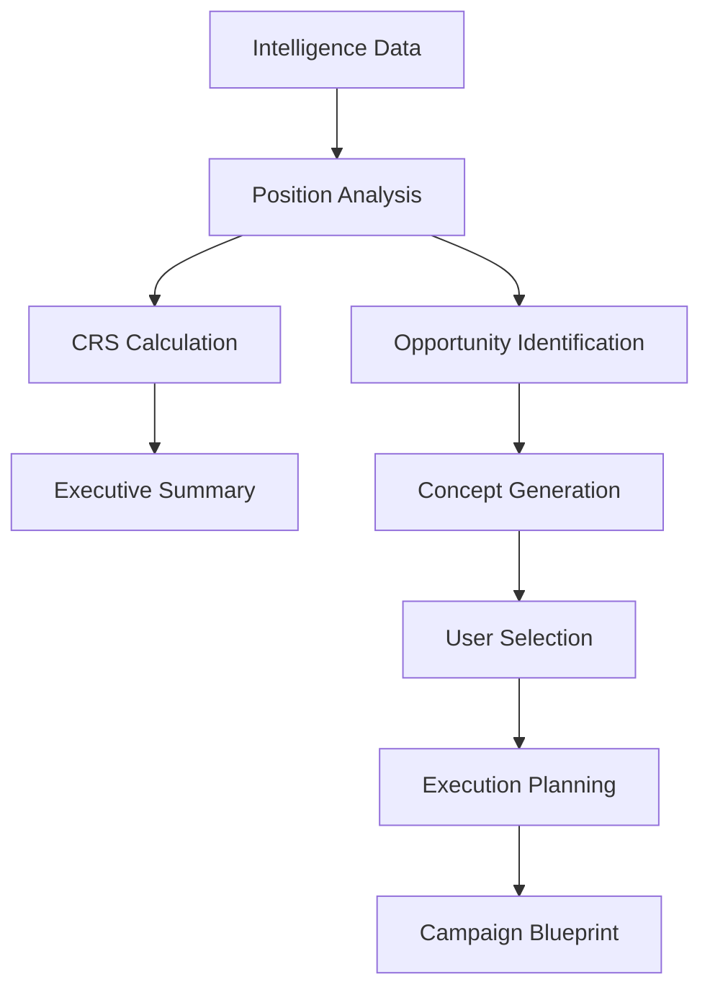

# Opportunity Engine Context

## Overview
The Opportunity Engine is the core value proposition of SignalDesk - it transforms raw intelligence data into actionable PR and strategic communication opportunities. Located in `OpportunityExecution.js`, it represents the "so what?" answer to intelligence gathering, turning insights into strategic actions.

## Component Architecture

### Main Component: OpportunityExecution.js
**Location**: `/frontend/src/components/Intelligence/OpportunityExecution.js`

**Purpose**: Three-step workflow that analyzes an organization's position and generates strategic PR opportunities based on competitive intelligence.

### Three-Step Workflow

#### Step 1: Position Analysis
- **Trigger**: User clicks "Begin Strategic Analysis"
- **Process**: 
  - Sends organization context + competitor/topic intelligence to Claude
  - Calculates Client Reality Score (CRS)
  - Identifies key opportunities and risks
- **Output**: Executive Position Analysis with CRS score

#### Step 2: Concept Selection
- **Trigger**: Automatic after position analysis completes
- **Process**:
  - AI generates 3-5 PR opportunity concepts
  - Each concept includes NVS (Narrative Vacuum Score)
  - User selects preferred concept
- **Output**: Selected opportunity concept for execution planning

#### Step 3: Execution Plan
- **Trigger**: User selects a concept
- **Process**:
  - Generates detailed campaign blueprint
  - Creates timeline and deliverables
  - Identifies resource requirements
- **Output**: Complete execution plan ready for implementation

## Key Metrics & Scoring

### Client Reality Score (CRS) - 0-100
Comprehensive organizational readiness assessment:

```javascript
// CRS Components (each 0-25 points)
- Execution Velocity: Speed to market capability
- Message Credibility: Authority and authenticity 
- Market Position: Current competitive standing
- Resource Readiness: Budget, team, and C-suite alignment
```

**Scoring Interpretation**:
- 80-100: Excellent position, ready for aggressive moves
- 60-79: Good position, selective opportunities recommended
- 40-59: Moderate position, focus on foundational improvements
- Below 40: Weak position, defensive strategies recommended

### Narrative Vacuum Score (NVS) - 1-100
Measures market opportunity based on demand vs. competitor activity:

```javascript
// NVS Calculation Factors
- Media Interest: How much is the topic being discussed?
- Competitor Silence: Are competitors addressing this?
- Audience Demand: Is there public interest?
- Timing Relevance: Is this timely?
```

**Score Ranges**:
- 80-100: High opportunity, immediate action recommended
- 60-79: Good opportunity, worth pursuing
- 40-59: Moderate opportunity, selective approach
- Below 40: Low opportunity, monitor only

## AI Prompting Strategy

### Position Analysis Prompt Structure
```javascript
const analysisPrompt = `
You are a McKinsey senior partner preparing an executive strategic communications briefing.

CLIENT: ${organizationName}

COMPETITIVE INTELLIGENCE:
${competitors.map(c => `• ${c.name}`).join('\n')}

MARKET DYNAMICS:
${topics.map(t => `• ${t.name}`).join('\n')}

STRATEGIC ANALYSIS REQUIRED:
1. CLIENT READINESS SCORE (CRS) - [0-100 with breakdown]
2. HIGH-VALUE OPPORTUNITIES (Top 3)
3. ACTION PLAN (72hr, 2wk, 30day)
4. EXECUTIVE CONSIDERATIONS
`;
```

### Opportunity Concept Generation
```javascript
const conceptPrompt = `
Generate 3-5 strategic PR opportunities based on:
- Market gaps identified
- Competitive weaknesses
- Trending topics with low saturation
- Client strengths

For each concept provide:
- name: Clear, action-oriented title
- type: thought_leadership/differentiation/news_hijacking/partnership/crisis_response
- nvsScore: 1-100 based on demand vs saturation
- timeSensitivity: immediate/this_week/this_month
- targetAudience: Primary media and stakeholder targets
- coreMessage: Key positioning statement
- executionPreview: What will be created
`;
```

## UI/UX Patterns

### Visual Design
- **Step Indicator**: Shows current position in 3-step workflow
- **Color Coding**:
  - Green (#10b981): Positive indicators, strengths
  - Blue (#6366f1): Opportunities, primary actions
  - Red (#dc2626): Risks, threats, warnings
  - Purple gradient: Executive elements, premium features

### Executive Position Modal
Simplified three-section analysis:
1. **Strengths** (Green) - Organizational advantages
2. **Opportunities** (Blue) - Market openings to exploit
3. **Risks & Threats** (Red) - Vulnerabilities to address

### Opportunity Cards
Each concept displayed with:
- Visual risk/reward indicators
- Time sensitivity badges
- Resource requirement tags
- NVS score prominently displayed
- One-click selection for execution planning

## Data Flow



## Integration Points

### Input Sources
1. **Organization Profile**: From EnhancedAIStrategyAdvisor
2. **Competitor Intelligence**: From UnifiedIntelligenceDashboard
3. **Topic Trends**: From intelligence monitoring
4. **Historical Performance**: From findings database

### Output Destinations
1. **Opportunities Table**: Stored for tracking
2. **Execution Plans**: Saved as actionable documents
3. **Performance Metrics**: Fed back for learning

## State Management

```javascript
// Key state variables
const [currentStep, setCurrentStep] = useState('analysis');
const [organizationAnalysis, setOrganizationAnalysis] = useState(null);
const [concepts, setConcepts] = useState([]);
const [selectedConcept, setSelectedConcept] = useState(null);
const [executionPlan, setExecutionPlan] = useState(null);
const [showAnalysisModal, setShowAnalysisModal] = useState(false);
```

## API Endpoints Used

### Analysis Generation
```javascript
POST /api/ai/claude/message
Body: {
  prompt: analysisPrompt,
  maxTokens: 2000,
  temperature: 0.7
}
```

### Opportunity Storage
```javascript
POST /api/opportunities
Body: {
  organization_id,
  concept_name,
  nvs_score,
  execution_plan,
  status: 'identified'
}
```

## Error Handling

1. **Failed Analysis**: Fallback to pre-generated insights
2. **Parsing Errors**: Robust JSON/text parsing with defaults
3. **Network Issues**: Retry logic with exponential backoff
4. **Invalid Scores**: Boundary checking and normalization

## Performance Optimizations

1. **Lazy Loading**: Concepts generated only when needed
2. **Caching**: Analysis results cached for session
3. **Progressive Enhancement**: Show partial results as available
4. **Debouncing**: Prevent multiple simultaneous analyses

## Future Enhancements

### Planned Features
1. **Multi-Language Support**: Generate concepts in different languages
2. **Industry Templates**: Pre-built opportunity patterns by vertical
3. **Historical Learning**: Use past campaign performance to improve suggestions
4. **Collaboration Tools**: Share and iterate on concepts with team
5. **Integration APIs**: Connect with PR distribution platforms

### Technical Improvements
1. **Real-time Collaboration**: WebSocket support for team reviews
2. **Advanced Scoring**: ML models for more accurate NVS/CRS
3. **Automated Execution**: One-click campaign launch
4. **Performance Tracking**: ROI measurement and attribution

## Testing Approach

### Unit Tests
- Score calculation accuracy
- Prompt generation consistency
- State transition logic

### Integration Tests
- API communication
- Data persistence
- Cross-component communication

### User Acceptance
- Three-step workflow completion
- Concept selection clarity
- Execution plan comprehensiveness

## Common Issues & Solutions

### Issue: Low CRS Scores
**Solution**: Focus on foundational improvements before pursuing opportunities

### Issue: No High-NVS Concepts
**Solution**: Expand competitive set or refine topic selection

### Issue: Execution Plans Too Generic
**Solution**: Provide more specific organization context in initial setup

## Code Examples

### Generating Opportunity Concepts
```javascript
const generateConcepts = async () => {
  setLoadingConcepts(true);
  try {
    const conceptsPrompt = createConceptsPrompt(organizationAnalysis);
    const response = await apiService.generateAIResponse({
      prompt: conceptsPrompt,
      maxTokens: 2000,
      temperature: 0.8
    });
    
    const parsedConcepts = parseConceptsResponse(response);
    setConcepts(parsedConcepts);
    setCurrentStep('concepts');
  } catch (error) {
    console.error('Concept generation failed:', error);
    setConcepts(fallbackConcepts);
  } finally {
    setLoadingConcepts(false);
  }
};
```

### CRS Score Visualization
```javascript
<div style={{
  width: '120px',
  height: '120px',
  borderRadius: '50%',
  background: `conic-gradient(
    ${getScoreColor(crsScore)} ${crsScore * 3.6}deg, 
    rgba(255,255,255,0.2) ${crsScore * 3.6}deg
  )`,
  display: 'flex',
  alignItems: 'center',
  justifyContent: 'center'
}}>
  <div style={{ fontSize: '2.5rem', fontWeight: '700' }}>
    {crsScore}
  </div>
</div>
```

## Conclusion

The Opportunity Engine is where SignalDesk delivers its core value - transforming intelligence into action. By maintaining a clear three-step workflow, robust scoring mechanisms, and AI-powered insights, it bridges the gap between knowing what's happening in the market and knowing what to do about it.