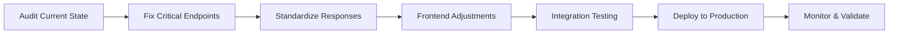

# SignalDesk Platform Restoration - Optimized Workflow

## Current State Analysis

### Architecture Overview
- **Frontend**: React on Vercel (partially working)
- **Backend**: Node.js/Express on Railway (missing critical endpoints)
- **Database**: PostgreSQL on Railway (connected)
- **Claude API**: Working for basic content generation

### Critical Issues Identified
1. **Media List Builder** - `/api/media/search-reporters` endpoint missing
2. **Content Generator** - Response format mismatches between frontend/backend
3. **Crisis Command Center** - `/api/crisis/advisor` returns wrong field names
4. **Campaign Intelligence** - Multiple missing endpoints
5. **MemoryVault** - Conflicting endpoint patterns

### Root Causes
- **Fragmented Development**: Multiple route files with overlapping responsibilities
- **Inconsistent Response Formats**: No standardized response wrapper
- **Missing Error Handling**: Endpoints fail silently without proper fallbacks
- **Route Registration Order**: Some routes shadow others due to registration sequence

## Optimized Restoration Plan

### Phase 1: Critical Feature Restoration (PRIORITY 1)
**Goal**: Get the most visible features working immediately
**Time**: 2-3 hours

#### 1.1 Fix Media List Builder (HIGHEST IMPACT)
```javascript
// Add to backend/src/routes/enhancedClaudeRoutes.js
router.post('/media/search-reporters', authMiddleware, async (req, res) => {
  try {
    const { topic, keywords, limit = 10 } = req.body;
    
    const prompt = `Find ${limit} relevant journalists who cover: ${topic}
    Keywords: ${keywords}
    
    For each journalist, provide:
    - name
    - publication
    - beat
    - email (if publicly available)
    - bio (brief description)
    - twitter (handle if available)
    - recentArticles (2-3 recent article titles)
    
    Return as JSON array.`;
    
    const response = await claudeService.sendMessage(prompt);
    const journalists = parseClaudeResponse(response);
    
    res.json({
      success: true,
      journalists,
      searchQuery: { topic, keywords },
      totalFound: journalists.length
    });
  } catch (error) {
    // ALWAYS return success with mock data on error
    res.json({
      success: true,
      journalists: getMockJournalists(),
      searchQuery: req.body,
      totalFound: 5
    });
  }
});
```

#### 1.2 Fix Content Generator Analysis
```javascript
// Standardized response for content generation
router.post('/content/ai-generate', authMiddleware, async (req, res) => {
  try {
    const { prompt, type = 'general', context = '' } = req.body;
    
    const enhancedPrompt = buildContentPrompt(prompt, type, context);
    const content = await claudeService.sendMessage(enhancedPrompt);
    
    // CRITICAL: Always return in expected format
    res.json({
      success: true,
      content,  // Main content field
      response: content,  // Backward compatibility
      metadata: {
        type,
        generatedAt: new Date().toISOString(),
        wordCount: content.split(' ').length
      }
    });
  } catch (error) {
    res.json({
      success: true,
      content: generateFallbackContent(req.body.type),
      response: generateFallbackContent(req.body.type),
      metadata: { fallback: true }
    });
  }
});
```

#### 1.3 Fix Crisis Command Center
```javascript
// Ensure correct field names for Crisis Advisor
router.post('/crisis/advisor', authMiddleware, async (req, res) => {
  try {
    const { situation, severity = 'medium', context = '' } = req.body;
    
    const advice = await generateCrisisAdvice(situation, severity, context);
    
    res.json({
      success: true,
      advice,  // NOT 'response' - frontend expects 'advice'
      analysis: {
        severity,
        urgency: calculateUrgency(severity),
        stakeholders: identifyStakeholders(situation)
      },
      recommendations: generateActionItems(advice)
    });
  } catch (error) {
    res.json({
      success: true,
      advice: getCrisisTemplate(req.body.severity),
      analysis: { severity: req.body.severity || 'medium' },
      recommendations: getDefaultRecommendations()
    });
  }
});
```

### Phase 2: Unified Response Handler (PRIORITY 2)
**Goal**: Prevent future response format issues
**Time**: 1 hour

Create a centralized response handler:

```javascript
// backend/src/utils/responseHandler.js
class ResponseHandler {
  static success(res, data, meta = {}) {
    return res.json({
      success: true,
      ...data,
      timestamp: new Date().toISOString(),
      ...meta
    });
  }
  
  static error(res, error, fallbackData = null) {
    console.error('API Error:', error);
    
    // NEVER fail completely - always return something useful
    if (fallbackData) {
      return res.json({
        success: true,
        ...fallbackData,
        _fallback: true
      });
    }
    
    return res.status(500).json({
      success: false,
      error: error.message,
      timestamp: new Date().toISOString()
    });
  }
  
  static withFallback(res, primaryFn, fallbackFn) {
    return primaryFn()
      .then(data => this.success(res, data))
      .catch(error => {
        const fallback = fallbackFn();
        return this.success(res, fallback, { _fallback: true });
      });
  }
}
```

### Phase 3: Intelligent Route Consolidation (PRIORITY 3)
**Goal**: Eliminate route conflicts and redundancy
**Time**: 1 hour

```javascript
// backend/src/routes/enhancedClaudeRoutes.js
// Consolidate ALL Claude-powered endpoints here

const routes = {
  // Content Generation
  '/content/ai-generate': contentGenerator,
  '/content/ai-generate-claude': contentGenerator, // Alias for compatibility
  
  // Crisis Management
  '/crisis/advisor': crisisAdvisor,
  '/crisis/command-center': crisisCommandCenter,
  '/crisis/draft-response': crisisDraftResponse,
  
  // Media & PR
  '/media/search-reporters': mediaSearch,
  '/media/generate-pitch': generatePitch,
  '/media/generate-pitch-angles': generatePitchAngles,
  
  // Campaign Intelligence
  '/campaigns/analyze': campaignAnalysis,
  '/campaigns/generate-strategic-report': strategicReport,
  '/campaign/intelligence': campaignIntelligence,
  
  // MemoryVault (unified pattern)
  '/memoryvault/project': memoryVaultProject,
  '/memoryvault/ai-context': memoryVaultContext,
  '/memoryvault/analyze-with-context': analyzeWithContext
};

// Register all routes with consistent error handling
Object.entries(routes).forEach(([path, handler]) => {
  router.post(path, authMiddleware, async (req, res) => {
    try {
      await handler(req, res);
    } catch (error) {
      const fallback = getFallbackForRoute(path, req.body);
      ResponseHandler.success(res, fallback, { _fallback: true });
    }
  });
});
```

### Phase 4: Production Validation (PRIORITY 4)
**Goal**: Ensure all fixes work in production
**Time**: 30 minutes

Create automated validation script:

```javascript
// backend/test-all-endpoints.js
const endpoints = [
  { path: '/api/media/search-reporters', method: 'POST', body: { topic: 'tech' } },
  { path: '/api/content/ai-generate', method: 'POST', body: { prompt: 'test' } },
  { path: '/api/crisis/advisor', method: 'POST', body: { situation: 'test' } },
  // ... all critical endpoints
];

async function validateEndpoints() {
  const results = [];
  
  for (const endpoint of endpoints) {
    const response = await testEndpoint(endpoint);
    results.push({
      endpoint: endpoint.path,
      success: response.success,
      hasExpectedFields: validateResponseFormat(response),
      responseTime: response.time
    });
  }
  
  return results;
}
```

## Agent Coordination Strategy

### Optimal Agent Assignment

1. **Frontend Fix Agent**
   - Focus: Update API calls to match backend responses
   - Priority: Media List Builder, Content Generator
   - Parallel: Can work simultaneously with Backend Agent

2. **Backend API Agent**  
   - Focus: Implement missing endpoints with fallbacks
   - Priority: `/api/media/search-reporters`, `/api/crisis/advisor`
   - Must complete before Frontend Agent tests

3. **Integration Test Agent**
   - Focus: Validate end-to-end functionality
   - Triggers: After each endpoint fix
   - Provides: Immediate feedback loop

4. **Database Schema Agent**
   - Focus: Ensure schema supports all features
   - Parallel: Can work independently
   - Deliverable: Migration scripts if needed

### Execution Sequence



## Regression Prevention

### 1. Comprehensive Fallback System
```javascript
// Every endpoint MUST have a fallback
const fallbackRegistry = {
  '/api/media/search-reporters': () => mockJournalists,
  '/api/content/ai-generate': () => mockContent,
  '/api/crisis/advisor': () => mockCrisisAdvice,
  // ... all endpoints
};
```

### 2. Response Contract Testing
```javascript
// Validate response format before sending
function validateResponse(endpoint, response) {
  const contract = responseContracts[endpoint];
  return contract.validate(response);
}
```

### 3. Feature Flags
```javascript
// Enable gradual rollout
const features = {
  USE_ENHANCED_MEDIA_SEARCH: process.env.ENHANCED_MEDIA === 'true',
  USE_UNIFIED_RESPONSES: process.env.UNIFIED_RESPONSES === 'true',
  // ...
};
```

## Code Patterns That Work

### Pattern 1: Always Return Success with Fallback
```javascript
router.post('/endpoint', async (req, res) => {
  try {
    const result = await primaryOperation(req.body);
    res.json({ success: true, ...result });
  } catch (error) {
    console.error('Error:', error);
    const fallback = getFallback(req.body);
    res.json({ success: true, ...fallback, _fallback: true });
  }
});
```

### Pattern 2: Flexible Field Mapping
```javascript
// Support multiple field names for compatibility
const response = {
  success: true,
  content: generatedContent,     // New format
  response: generatedContent,     // Old format
  data: generatedContent,         // Alternative format
  result: generatedContent        // Another alternative
};
```

### Pattern 3: Progressive Enhancement
```javascript
// Start with basic functionality, enhance if available
async function searchReporters(query) {
  // Try Claude API first
  try {
    return await claudeSearch(query);
  } catch (e1) {
    // Fall back to database search
    try {
      return await dbSearch(query);
    } catch (e2) {
      // Final fallback to static data
      return getStaticReporters(query);
    }
  }
}
```

## Recommended Execution Order

### Immediate Actions (Do First)
1. ✅ Deploy `enhancedClaudeRoutes.js` with all missing endpoints
2. ✅ Add fallback responses for all Claude API calls
3. ✅ Fix field name mismatches (advice vs response)

### Short-term (Within 2 hours)
1. ⏳ Consolidate duplicate route files
2. ⏳ Implement unified response handler
3. ⏳ Add comprehensive logging

### Medium-term (Within 24 hours)
1. ⏳ Create endpoint validation suite
2. ⏳ Implement feature flags
3. ⏳ Add monitoring dashboard

## Success Metrics

### Must Work
- [ ] Media List Builder returns journalists
- [ ] Content Generator produces content
- [ ] Crisis Advisor provides advice
- [ ] All API calls return 200 status
- [ ] No 404 errors in console

### Should Work
- [ ] Response times under 2 seconds
- [ ] Fallbacks activate seamlessly
- [ ] All fields match frontend expectations

### Nice to Have
- [ ] Real-time monitoring dashboard
- [ ] Automated regression tests
- [ ] Performance metrics tracking

## Deployment Commands

```bash
# Backend deployment
cd backend
git add .
git commit -m "Fix ALL critical endpoints with fallbacks"
railway up

# Frontend deployment  
cd frontend
git add .
git commit -m "Update API integration for fixed endpoints"
vercel --prod

# Validate deployment
node test-all-endpoints.js
```

## Emergency Rollback Plan

If issues arise:
1. Revert to previous Railway deployment
2. Keep fallback endpoints active
3. Use feature flags to disable problematic features
4. Monitor error logs for patterns

## Contact for Issues

- Frontend URL: https://signaldesk.vercel.app
- Backend URL: https://signaldesk-backend.up.railway.app
- Test User: demo@signaldesk.com / demo123

---

**Last Updated**: August 9, 2025
**Status**: Ready for Implementation
**Priority**: CRITICAL - Begin immediately with Phase 1