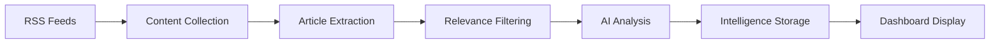

# SignalDesk Monitoring Capabilities & Sources

## Overview
This document outlines the current monitoring capabilities, data sources, and intelligence gathering features implemented in the SignalDesk platform.

## Current Architecture

### 1. Intelligence Targets
SignalDesk monitors two primary types of targets:
- **Competitors**: Other companies in your space
- **Topics**: Industry themes, technologies, or trends

Each target can have:
- Custom RSS feeds
- Keywords for searching
- Priority levels (high/medium/low)
- Active/inactive status

### 2. Data Sources

#### Currently Implemented Sources

##### RSS Feeds (Primary Source)
The platform uses RSS feeds as its primary data source for monitoring:

**Default RSS Feeds**:
```javascript
// Technology & Business News
- https://techcrunch.com/feed/
- https://www.theverge.com/rss/index.xml
- https://feeds.feedburner.com/venturebeat/SZYF
- https://www.prnewswire.com/rss/news-releases-list.rss

// Can be customized per target via EnhancedSourceConfigurator
```

**Custom RSS Configuration**:
- Users can add unlimited custom RSS feeds per target
- AI-powered RSS feed discovery based on target profile
- Real-time feed validation
- Automatic parsing and content extraction

##### AI-Powered Source Discovery
The platform includes an AI agent that suggests relevant RSS feeds:
```javascript
// Discovers feeds based on:
- Target name and type
- Industry context
- Geographic relevance
- Content freshness
```

### 3. Monitoring Capabilities

#### A. Competitor Health Monitoring
Analyzes competitors across four key dimensions:

**1. Financial Signals**
- Revenue indicators
- Funding announcements
- Financial performance mentions
- Investment activities

**2. Leadership Signals**
- Executive changes
- Key hires/departures
- Board modifications
- Strategic appointments

**3. Product Signals**
- Product launches
- Feature updates
- Service expansions
- Technology adoptions

**4. Partnership Signals**
- Strategic alliances
- Joint ventures
- Customer wins/losses
- Ecosystem developments

**Health Score Calculation**: 0-100 composite score based on all signals

#### B. Topic Positioning Analysis
Evaluates how competitors are positioned on key topics:

**Positioning Levels**:
- **Strong**: Dominant presence, thought leadership
- **Moderate**: Active participation, some visibility
- **Weak**: Minimal presence, reactive stance
- **None**: No meaningful activity detected

**Analysis Factors**:
- Mention frequency
- Content depth
- Sentiment analysis
- Engagement levels

#### C. Trend Detection
- Identifies emerging themes in monitored content
- Tracks topic velocity (growing/stable/declining)
- Highlights narrative shifts
- Spots market opportunities

### 4. Intelligence Processing Pipeline



**Processing Steps**:
1. **Collection**: Continuous polling of configured RSS feeds
2. **Extraction**: Full article content retrieval
3. **Filtering**: Relevance scoring based on keywords/topics
4. **Analysis**: Claude AI processes content for insights
5. **Storage**: Findings saved with metadata
6. **Display**: Real-time dashboard updates

### 5. Analysis Capabilities

#### AI-Powered Analysis (Claude API)
Each piece of collected content is analyzed for:

**Competitor Intelligence**:
```javascript
- Company health indicators
- Strategic moves
- Market positioning
- Competitive threats
- Opportunity identification
```

**Topic Analysis**:
```javascript
- Key themes extraction
- Trend identification
- Sentiment analysis
- Narrative evolution
- Market gaps
```

#### Unified Intelligence View
Combines competitor and topic analysis to show:
- How each competitor is positioned on each topic
- Market landscape visualization
- Strategic opportunity identification
- Competitive blind spots

### 6. Monitoring Features

#### Real-Time Monitoring
- Continuous feed polling (configurable intervals)
- Instant analysis of new content
- Real-time dashboard updates
- Priority-based processing

#### Historical Analysis
- Trend tracking over time
- Historical positioning changes
- Pattern recognition
- Predictive insights

#### Alert Capabilities
- High-priority finding notifications
- Competitive threat alerts
- Opportunity notifications
- Custom alert rules (planned)

### 7. Data Management

#### Storage
- PostgreSQL database for all findings
- Structured data model:
  - `findings` table: Raw intelligence data
  - `intelligence_targets`: Monitored entities
  - `target_sources`: RSS feed configurations
  - `opportunities`: Identified strategic opportunities

#### Data Retention
- All findings stored indefinitely
- Historical analysis available
- Audit trail maintained
- Export capabilities (planned)

### 8. Integration Points

#### Current Integrations
- **Claude AI API**: For intelligent analysis
- **RSS Parser**: For feed processing
- **Web Scraping**: Basic article extraction

#### API Endpoints
```javascript
// Monitoring Control
POST /api/intelligence/monitor/start
GET /api/intelligence/monitor/status/:organizationId
POST /api/intelligence/monitor/stop

// Source Management  
POST /api/intelligence/targets/:targetId/sources
GET /api/intelligence/targets/:targetId/sources
DELETE /api/intelligence/targets/:targetId/sources/:sourceId

// Intelligence Retrieval
GET /api/intelligence/findings/:targetId
GET /api/intelligence/analysis/unified/:organizationId
POST /api/intelligence/analysis/competitor
POST /api/intelligence/analysis/topic
```

### 9. Limitations & Considerations

#### Current Limitations
1. **Source Types**: Currently limited to RSS feeds
2. **Rate Limiting**: Depends on source feed update frequency
3. **Content Access**: Limited to publicly available content
4. **Language**: English-only analysis
5. **Real-time**: Near real-time, not instant

#### Planned Enhancements
1. **Additional Sources**:
   - Social media monitoring
   - API integrations (when available)
   - Web scraping expansion
   - Email newsletter monitoring

2. **Advanced Analysis**:
   - Multi-language support
   - Image/video analysis
   - Predictive modeling
   - Custom ML models

3. **Workflow Automation**:
   - Automated report generation
   - Slack/email notifications
   - Campaign trigger automation
   - API webhooks

### 10. Best Practices

#### Source Configuration
1. **Quality over Quantity**: Choose high-quality, relevant feeds
2. **Diverse Sources**: Mix mainstream and niche publications
3. **Update Frequency**: Balance between coverage and noise
4. **Validation**: Regularly check feed health

#### Target Setup
1. **Specific Keywords**: Use precise, relevant keywords
2. **Competitor Selection**: Focus on direct competitors
3. **Topic Relevance**: Choose topics aligned with strategy
4. **Priority Setting**: Allocate resources effectively

#### Analysis Optimization
1. **Regular Review**: Check dashboard daily
2. **Pattern Recognition**: Look for trends, not just events
3. **Cross-Reference**: Validate findings across sources
4. **Action Orientation**: Convert insights to opportunities

## Usage Examples

### Example 1: Monitoring a Competitor
```javascript
// Target Configuration
{
  name: "Acme Corp",
  type: "competitor",
  keywords: ["Acme Corp", "Acme Corporation", "@acmecorp"],
  sources: [
    "https://acmecorp.com/blog/feed",
    "https://techcrunch.com/tag/acme-corp/feed/",
    "Industry-specific RSS feeds"
  ]
}

// Resulting Intelligence
{
  healthScore: 78,
  trend: "improving",
  signals: {
    financial: "Series C funding announced",
    leadership: "New CTO hired from Google",
    product: "AI feature launch planned",
    partnerships: "AWS partnership expanded"
  },
  topicPositioning: {
    "AI": "Strong",
    "Cloud": "Moderate",
    "Security": "Weak"
  }
}
```

### Example 2: Topic Monitoring
```javascript
// Topic Configuration
{
  name: "Generative AI",
  type: "topic",
  keywords: ["generative AI", "LLM", "GPT", "AI content"],
  sources: [
    "https://openai.com/blog/rss/",
    "AI research publication feeds",
    "Industry news feeds"
  ]
}

// Resulting Analysis
{
  trendStatus: "rapidly growing",
  keyThemes: [
    "Enterprise adoption accelerating",
    "Regulatory concerns emerging",
    "New use cases in healthcare"
  ],
  competitorActivity: {
    "high": ["Microsoft", "Google"],
    "medium": ["Salesforce", "Adobe"],
    "low": ["Oracle", "SAP"]
  },
  opportunities: [
    "Market gap in specialized healthcare applications",
    "Unaddressed SMB market segment"
  ]
}
```

## Troubleshooting

### Common Issues

1. **No findings appearing**
   - Check RSS feed validity
   - Verify target keywords
   - Ensure monitoring is started
   - Check organization ID

2. **Incomplete analysis**
   - Verify Claude API key
   - Check for rate limiting
   - Review error logs

3. **Feed configuration failing**
   - Validate RSS URL format
   - Check feed accessibility
   - Ensure proper XML structure

## Conclusion

SignalDesk's monitoring capabilities provide comprehensive intelligence gathering through RSS feeds, advanced AI analysis, and unified competitor-topic positioning. The system is designed to transform raw data into actionable strategic insights, identifying opportunities and threats in real-time.